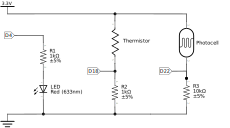

# ESP32-webservers
This repository contains several webservers for the ESP32 microcontroller used to control a LED and read sensors through websockets. The ESP32 is connected to a WiFi network and uses the same electronic circtuit as a base for all the webservers.

## Webservers
3 webservers using the same base electronic schematic are implemented:
- *webserver_LED*. Using a simple WebServer, which supports only one simultaneous client, a LED can be switched on and off from. jQuery AJAX with JSON is used for client-server communications.
- *webserver_data*. Using an Async HTTP and WebSocket server, the processed readings from a thermistor and a photoresistor will be transmitted to the clients through websockets in a JSON format and presented live with [charts.js](https://www.chartjs.org/). **TO BE IMPLEMENTED.**
- *webserver*. This server combines the functionality of *webserver-LED* and *webserver-data*, controlling the LED and sending data to the clients using an async HTTP and WebSocket server. **TO BE IMPLEMENTED.**

[Bootstrap](https://getbootstrap.com/), the CSS framework, will be used to decorate the webpages.

## Schematic
The following parts have been used in the electronic circuit. Nevertheless, they can be replaced for other similar ones with little change in the code.
- 1x LED.
- 1x MF52D NTC thermistor.
- 1x photoresistor.
- 2x 1 k&#8486; resistances.
- 1x 10 k&#8486; resistance.

ESP32 pins in the schematic are referred as 3.3V, GND and D*.

## Requirements
ESP32 libraries:
- [WiFi.h](https://github.com/espressif/arduino-esp32/tree/master/libraries/WiFi)
- [WebServer](https://github.com/espressif/arduino-esp32/tree/master/libraries/WebServer).

External libraries:
- [AsyncTCP](https://github.com/me-no-dev/AsyncTCP). Async TCP Library for ESP32.
- [ArduinoJson](https://arduinojson.org). JSON library for embedded C++.
- [ESPAsyncWebServer](https://github.com/me-no-dev/ESPAsyncWebServer). Async HTTP and WebSocket Server.

## Usage
1. Connect the ESP32 as showed in the schematics.
2. Install the standard ESP libraries either using the Arduino IDE or directly from [Espressif](https://docs.espressif.com/projects/esp-idf/en/latest/esp32/).
3. Install the required external libraries.
4. Download the repository and rename the file *constants.h.TEMPLATE* to *constants.h*. Change there the SSID and PASSWORD correspoding to the WiFi network.
5. Flash the ESP32:
    - For VSCode, modify the *arduino.json* and *c_cpp_properties.json* files to add the missing libraries and select the desired .ino file.
    - For the Arduino IDE, change the *src* folder to match the name of the *.ino* file.

## License
[GPL-3.0](https://choosealicense.com/licenses/gpl-3.0/)